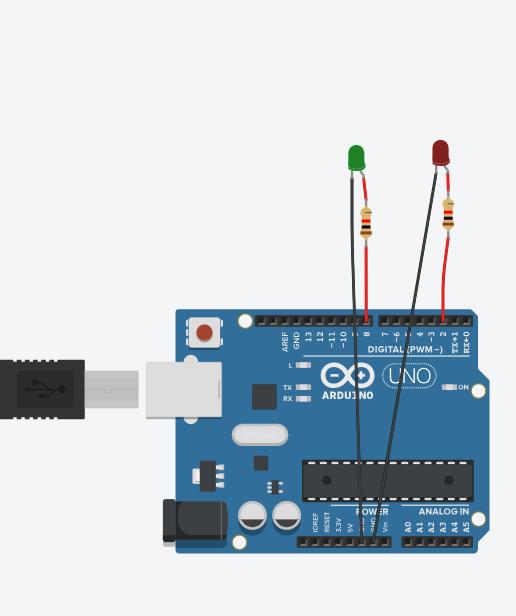
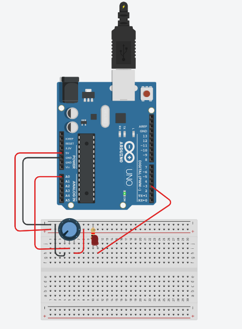
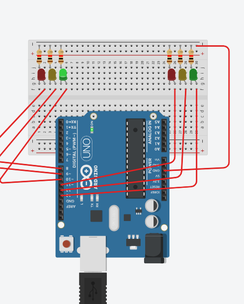

# Aula 2 — Semáforo com LEDs


### Código — Semáforo piscando vermelho e verde

```cpp
int verde = 8;
int vermelho = 2;

void setup()
{
  pinMode(verde, OUTPUT);
  pinMode(vermelho, OUTPUT);
}

void loop()
{
  digitalWrite(verde, 1);
  digitalWrite(vermelho, 0);
  delay(1000);
  digitalWrite(verde, 0);
  digitalWrite(vermelho, 1);
  delay(1000);
}
```

---

### Aula 2 — Semáforo piscando verde


### Código — Semáforo piscando vermelho e verde

```cpp
int verde = 8;
int vermelho = 2;

void setup()
{
  pinMode(verde, OUTPUT);
  pinMode(vermelho, OUTPUT);
}

void loop()
{
  digitalWrite(verde, 1);
  digitalWrite(vermelho, 0);
  delay(1000);
  digitalWrite(verde, 0);
  digitalWrite(vermelho, 1);
  delay(1000);
}
```

---

### Aula 2 — Montagem do circuito



### Código — Semáforo

```cpp
int verde = 8;
int vermelho = 2;

void setup()
{
  pinMode(verde, OUTPUT);
  pinMode(vermelho, OUTPUT);
}

void loop()
{
  digitalWrite(verde, 1);
  digitalWrite(vermelho, 0);
  delay(1000);
  digitalWrite(verde, 0);
  digitalWrite(vermelho, 1);
  delay(1000);
}
```

---

# Aula 4 — Experimento 1: Servo Motor com Potenciômetro


### Código — Controle do servo motor pelo potenciômetro

```cpp
#include <Servo.h>

Servo servo;

int potenc = 0;
int angulo = 0; 

void setup(){ 
  servo.attach(11); 
} 

void loop(){ 

  potenc = analogRead(0); 

  angulo = map(potenc, 0, 1023, 0, 180);

  servo.write(angulo); 
  delay(15); 

}
```

---

# Aula 4 — Experimento 2: Display de 7 Segmentos


### Código — Contador no display de 7 segmentos

```cpp
int a = 4, b = 5, c = 6, d = 7, e = 8, f = 9, g = 10;
int botao = 2;
int num = 0;
int entrada[7] = {a,b,c,d,e,f,g};
int display[10][7] = {{a,b,c,d,e,f},{b,c},{a,b,d,e,g},{a,b,c,d,g},{b,c,f,g},{a,c,d,f,g},{a,c,d,e,f,g},{a,b,c},{a,b,c,d,e,f,g},{a,b,c,f,g}};
void setup() {
	for(int i=0;i<7;i++) pinMode(entrada[i],OUTPUT);
	pinMode(botao,INPUT);
}
void loop() {
	int click = digitalRead(botao);
	delay(100); //Evitar flutuaçao no clique
	if(click) num++;
	if(num < 10) numero(num); else num = 0;
}
void numero(int coluna) {
	for(int i=0;i<7;i++) digitalWrite(entrada[i],1);
	for(int linha=0;linha<7;linha++){
		digitalWrite(display[coluna][linha],0);
	}
}
```

---

# Aula — Pista de Pouso


### Código — Controle dos LEDs com sensor de luminosidade

```cpp
const int fotoresistor = A0;

int leds[] = {
  2, 3, 4, 5, 6,
  7, 8, 9, 10, 11
};

const int quantidadeLeds = 10;

void setup() {
  for (int i = 0; i < quantidadeLeds; i++) {
    pinMode(leds[i], OUTPUT);
  }

  Serial.begin(9600);
}

void loop() {
 
  int luminosidade = analogRead(fotoresistor);
  int quantidadeAcesos = map(luminosidade, 0, 1023, 10, 0);

  for (int i = 0; i < quantidadeLeds; i++) {

    if (i < quantidadeAcesos) {
      digitalWrite(leds[i], HIGH);
    } else {
      digitalWrite(leds[i], LOW);
    }
  }

  Serial.print("Luminosidade: ");
  Serial.print(luminosidade);

  Serial.print(" | LEDs acesos: ");
  Serial.println(quantidadeAcesos);

  delay(100);
}
```

---

# Aula — Potenciômetro



### Código — Controle do LED pelo potenciômetro

```cpp
int led = 3; // Variável led assume o valor do pino 3
int potenc = 0; // variável recebe o valor proveniente do sensor
void setup(){ // Configurações - Pinos de Entrada/Saída
pinMode(led, OUTPUT); // Configura led(pino 3) como saída
} // Fim da configuração
void loop(){ // Início do Programa
 potenc = analogRead(0); // Variável potenci recebe o valor da entrada A0
if (potenc >512){ // Se pino 2 for igual a 1:
digitalWrite(led,1); // Aciona pino 13, NL=1 ou 5V na saída 3
} else { // Senão:
digitalWrite(led,0); // Desliga a saída digital 3
} // Fim do Senão
} // Fim do Programa
```

---

# Aula — Semáforo



### Código — Semáforo de dois sentidos

```cpp
int vermelho1 = 8;
int amarelo1 = 9;
int verde1 = 10;

int vermelho2 = A0;
int amarelo2 = A1;
int verde2 = A2;

void setup() {
  pinMode(vermelho1, OUTPUT);
  pinMode(amarelo1, OUTPUT);
  pinMode(verde1, OUTPUT);

  pinMode(vermelho2, OUTPUT);
  pinMode(amarelo2, OUTPUT);
  pinMode(verde2, OUTPUT);
}

void loop() {

  digitalWrite(verde1, HIGH);
  digitalWrite(amarelo1, LOW);
  digitalWrite(vermelho1, LOW);

  digitalWrite(vermelho2, HIGH);
  digitalWrite(amarelo2, LOW);
  digitalWrite(verde2, LOW);

  delay(5000);

  digitalWrite(verde1, LOW);
  digitalWrite(amarelo1, HIGH);

  delay(2000);

  digitalWrite(amarelo1, LOW);
  digitalWrite(vermelho1, HIGH);

  digitalWrite(vermelho2, LOW);
  digitalWrite(verde2, HIGH);

  delay(5000);

  digitalWrite(verde2, LOW);
  digitalWrite(amarelo2, HIGH);

  delay(2000);

  digitalWrite(amarelo2, LOW);
}
```
